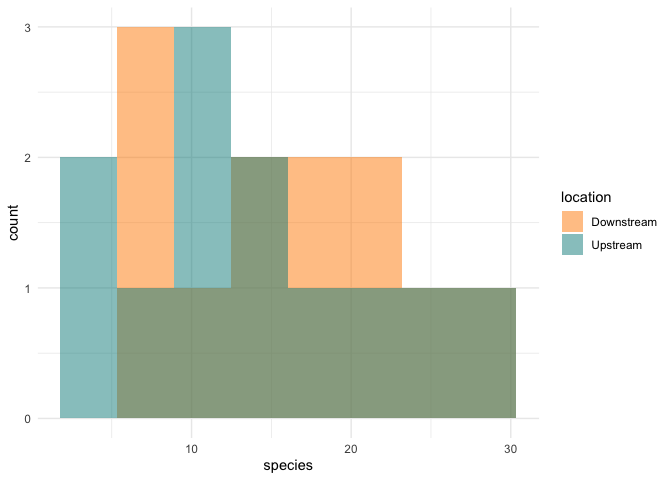

Lab 6 Comparing two means
================
Jonathan Kanyinda
2021-04-22

Researchers studying the number of electric fish species living in
various parts of the Amazon basin were interested in whether the
presence of tributaries affected the local number of electric fish
species in the main rivers (Fernandes et al. 2004).

They counted the number of electric fish species above and below the
entrance point of a major tributary at 12 different river locations.

The data is provided in your GitHub repository.

For each question below, write a sentence answering the question and
show the code you used to come up with the answer, if applicable.

## Question A

> What is the mean different in the number of species between areas
> upstream and downstream of a tributary? What is the 95% confidence
> interval of this mean difference. Show your code and write a sentence
> giving your
answer

ANSWER

``` r
# load packages -----------------------------------------------------------

library(tidyverse)
```

    ## ── Attaching packages ─────────────────────────────────────── tidyverse 1.3.0 ──

    ## ✓ ggplot2 3.3.3     ✓ purrr   0.3.4
    ## ✓ tibble  3.0.4     ✓ dplyr   1.0.2
    ## ✓ tidyr   1.1.2     ✓ stringr 1.4.0
    ## ✓ readr   1.4.0     ✓ forcats 0.5.0

    ## ── Conflicts ────────────────────────────────────────── tidyverse_conflicts() ──
    ## x dplyr::filter() masks stats::filter()
    ## x dplyr::lag()    masks stats::lag()

``` r
# read data ---------------------------------------------------------------

fish <- read_csv("chap12q19ElectricFish.csv")
```

    ## 
    ## ── Column specification ────────────────────────────────────────────────────────
    ## cols(
    ##   tributary = col_character(),
    ##   speciesUpstream = col_double(),
    ##   speciesDownstream = col_double()
    ## )

``` r
# put data in tidy format ------------------------------------------------

fish_long <- 
  pivot_longer(fish, speciesUpstream:speciesDownstream,
               names_to = "location",
               values_to = "species") %>% 
  mutate(location = str_remove(location, c("species"))) %>% 
  print()
```

    ## # A tibble: 24 x 3
    ##    tributary location   species
    ##    <chr>     <chr>        <dbl>
    ##  1 Içá       Upstream        14
    ##  2 Içá       Downstream      19
    ##  3 Jutaí     Upstream        11
    ##  4 Jutaí     Downstream      18
    ##  5 Japurá    Upstream         8
    ##  6 Japurá    Downstream       8
    ##  7 Coari     Upstream         5
    ##  8 Coari     Downstream       7
    ##  9 Purus     Upstream        10
    ## 10 Purus     Downstream      16
    ## # … with 14 more rows

``` r
t.test(formula = species ~ location, data = fish_long)
```

    ## 
    ##  Welch Two Sample t-test
    ## 
    ## data:  species by location
    ## t = 0.59249, df = 21.81, p-value = 0.5596
    ## alternative hypothesis: true difference in means is not equal to 0
    ## 95 percent confidence interval:
    ##  -4.587031  8.253697
    ## sample estimates:
    ## mean in group Downstream   mean in group Upstream 
    ##                 16.41667                 14.58333

Mean difference :

Mean\_difference = 16.41667 - 14.58333

Mean\_difference \# The mean difference is 1.83334

95% confidence intervall of Mean length difference :

Upper\_limit = -4.587031

Lower\_limit = 8.253697

## Question B

> Test the hypothesis that the tributaries have no effect on the number
> of species of electric fish.

ANSWER

``` r
t.test(formula = species ~ location, data = fish_long)
```

    ## 
    ##  Welch Two Sample t-test
    ## 
    ## data:  species by location
    ## t = 0.59249, df = 21.81, p-value = 0.5596
    ## alternative hypothesis: true difference in means is not equal to 0
    ## 95 percent confidence interval:
    ##  -4.587031  8.253697
    ## sample estimates:
    ## mean in group Downstream   mean in group Upstream 
    ##                 16.41667                 14.58333

The p value 0.5596 is greater than 0.05, therefore the null hypothesis
will not be rejected. This is because the null hypotheis is rejected
when the p value is smaller than 0.05, and since the obtained p value
was 0.5596 which was greater than 0.05, there was failure to reject the
null hypothesis stating that there was no difference in teh number of
species in the main rivers caused by the presence of tributaries.

## Question C

> State the assumptions that you had to make to complete parts (A) and
> (B). Create a graph to assess whether one of those assumptions was
> met.

ANSWER

``` r
fish_long %>% 
  ggplot(aes(x = species)) +
  geom_histogram(
    aes(fill = location), 
    bins = 15, 
    alpha = 0.5, 
    position = "identity"
  ) +
  scale_fill_manual(values = c("darkorange","cyan4")) +
  theme_minimal()
```

<!-- -->

For Question A, the assumption made was that the presence of tributaries
did not affect the local number of electric fish in the main rivers
(Also the Null hypothesis). For part B, the assumption was that the data
was normally distributed and that the peaks/umps of the two locations
would be close enough to generate an overall normal distribution. Based
on the graph,the distribution does not appear to be normal and therefore
does not meet teh assumption made about the normality.
